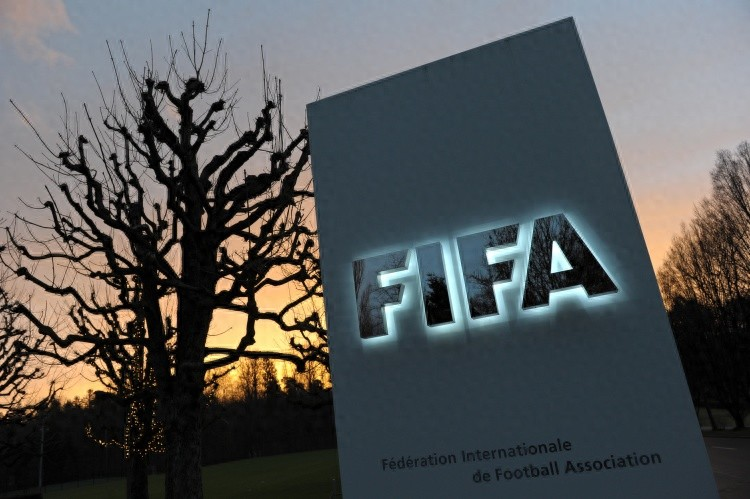

# 印媒：中国已达转播协议，印度认为两届打包价3500万美元仍过高
> 原文链接: https://www.toutiao.com/article/7640077059028468260/?log_from=fbe58ce5528de8_1778861200052

---

直播吧05月15日讯 据印度媒体《今日印度》最新报道，中国已经与FIFA达成世界杯转播协议，而印度方面仍未谈妥。

报道称，距离2026年世界杯开赛已不到一个月，印度球迷对在哪里观看这一盛大赛事仍完全无所适从。严重的转播不确定性现已进入司法程序，德里高等法院正式向印度中央政府和Prasar Bharati广播公司发出通知。

印度的转播僵局与邻国中国形成鲜明对比。中国中央广播电视总台最近打破了谈判僵局，正式锁定了其世界杯转播协议。此前FIFA曾透露，在全球超过175个地区已经达成转播协议的情况下，中印两国的谈判均进展滞后。

印度市场当前危机的根源在于FIFA的估值与当地广播公司愿意支付的价格之间存在巨大差距。《今日印度》指出**，FIFA最初对2026年和2030年两届赛事在印度的转播权打包估值接近1亿美元。由于国内完全没有兴趣，这一数字后来被削减至约3500万美元，但商业协议仍未达成。**

不利的时差进一步损害了收视预期。由于本届赛事由美国、加拿大和墨西哥联合主办，大多数比赛将在印度的深夜至凌晨时段进行。这大大降低了转播商的潜在广告价值，而他们已在昂贵的板球版权上投入了大量资金。

尽管准备窗口期越来越短，全印足球联合会仍然充满信心。AIFF副秘书长M·萨蒂亚纳拉扬指出，印度庞大的市场规模使得FIFA极不可能完全忽视这个国家，这让球迷们期待最终的协议敲定。